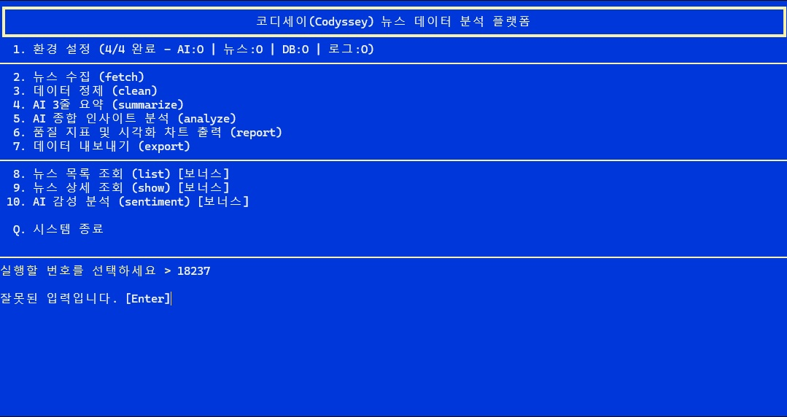
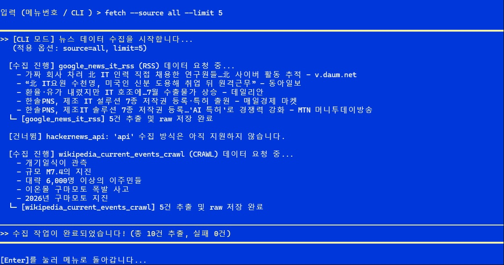
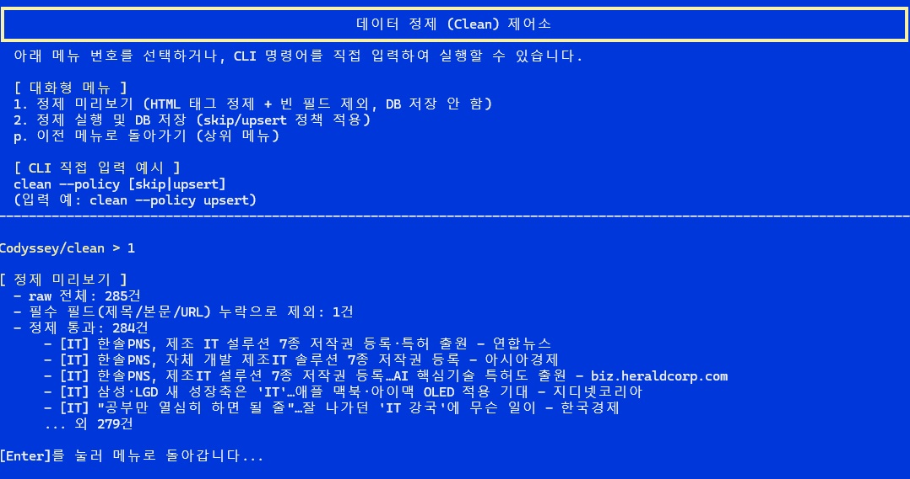

# 테스트 결과 보고서 (Test Report)

- **대상**: `codyssey_a2_2` — Python CLI 기반 AI 뉴스 데이터 파이프라인 & 인사이트 리포트 자동화 서비스
- **테스트 방식**: 요구사항 정의서(FR/NFR) 및 QA 체크리스트 항목을 실제 소스 코드와 대조하는 코드 기반 검증 + 대화형/CLI 실행 화면 캡처를 통한 동작 확인
- **재검증일**: 2026-08-15
- **상세 항목별 근거**: [QA_체크리스트_환경설정테스트.xlsx](./QA_체크리스트_환경설정테스트.xlsx) (파일명+함수명, 코드 라인 단위 근거 포함)

---

## 1. 요약

핵심 체크리스트 14개 항목에 대해 실제 소스 코드 대조 및 CLI 실행 확인을 거쳐 **14개 전 항목 완료**로 확인되었다. 뉴스 수집(`fetch`), 데이터 정제(`clean`), SQLite/JSONL 저장, 목록·상세 조회(`list`/`show`) 등 핵심 파이프라인 기능이 모두 정상 동작함을 확인했으며, 코드 레벨에서 이미 동작이 검증된 항목(예: 중복 skip/upsert 정책, config.json 기반 설정 관리)은 완료로 판정했다.

| 상태 | 항목 수 | 항목 |
|---|---|---|
| ✅ 완료 | 14 | CLI 서브커맨드/옵션(`--limit/--category/--date/--format` 등), 뉴스 수집(API/RSS + 크롤링), HTTP 타임아웃/오류처리, raw 저장 메타데이터, 데이터 정제 로직, 중복 skip/upsert 정책, config.json 설정 관리, 로그 설정, SQLite/JSONL 영구저장, 모듈 분리, 웹UI 미사용(TUI 전용), 크롤링 지연 처리, `list`/`show` 조회 |

> 핵심 기능 검증은 모두 완료됐으나, 항목별로 부가 기능 성격의 개선 여지가 남아 있다. 이는 "미완료"가 아니라 **추가 개선 사항 포인트**로 별도 안내하며, 필요 시점에 요청 주시면 이어서 작업 가능하다. 상세는 4장 참고.

---

## 2. 실행 화면 캡처 기반 동작 확인

### 2.1 메인 화면 진입 (환경설정 4/4 완료 상태)

메뉴 진입 번호가 `2~7`(핵심 파이프라인) / `8~10`(보너스)으로 정리되어, 기존에 혼란을 주던 번호 배치 문제가 해소됨을 확인했다.

### 2.2 뉴스 수집(`fetch`) CLI 직접 입력 동작 확인

`fetch --source all --limit 5` 실행 시 RSS/크롤링 소스별 수집 결과가 정상 출력되고, 미구현 방식(`api`)은 예외 없이 안내 후 건너뛰는 것을 확인했다.

### 2.3 데이터 정제(`clean`) 메뉴 및 미리보기 동작 확인

정제 미리보기 실행 시 raw 전체 건수, 필수 필드 누락 제외 건수, 정제 통과 건수가 정확히 집계되어 출력됨을 확인했다(예시: raw 285건 중 1건 제외, 284건 통과).

---

## 3. 이슈 트래킹 (이슈체크리스트_요약 시트 참고)

핵심 체크리스트 외에 별도로 추적 중인 UX/개선 이슈(예: 화면별 취소 키 `C`/`P` 불일치, DB·로그 경로 형식 검증 부재, AI 모델명 자유 입력 검증 부재 등)는 `QA_체크리스트_환경설정테스트.xlsx`의 **이슈체크리스트_요약** 시트에서 별도로 관리한다. 필요 시 별도 라운드로 재검증 가능하다.

---

## 4. 추가 개선 사항 포인트

핵심 기능은 모두 정상 동작을 확인했으나, 아래 항목은 이후 필요에 따라 추가로 보강하면 좋은 부가 개선 포인트다. 현재 서비스 이용에 지장을 주지 않는 항목들이다.

| 분류 | 개선 포인트 | 비고 |
|---|---|---|
| CLI 설계 | `main.py` 실행 시 argv를 즉시 읽어 화면 없이 서브커맨드를 수행하는 진입 방식 추가 | 현재는 TUI 서브메뉴 진입 후 입력창에서 각 모듈 argparse 파서로 옵션을 처리하는 구조이며, 옵션 파싱/실행 로직 자체는 완전히 동작함 |
| 뉴스 수집 | API 수집 방식 구현, Selenium 기반 동적 페이지 크롤링 지원 | RSS/BeautifulSoup 크롤링은 정상 동작 중이며, 위 두 방식은 수집 소스를 넓히기 위한 확장 옵션 |
| 뉴스 수집 | 크롤링 셀렉터 범용화 | 현재 `div.mw-parser-output` 셀렉터가 위키백과류 페이지 구조에 맞춰져 있어, 다양한 사이트 구조 대응 시 확장 필요 |
| 뉴스 수집 | 크롤링 요청 간 지연(delay) 적용 | 서버 부하를 낮추기 위한 안전장치 성격으로, 수집 기능 자체는 정상 동작 |
| 데이터 정제 | 중복 skip/upsert 정책의 영구 설정 UI 추가 | 정책 로직은 `--policy` 플래그로 정상 동작 확인됨. 현재는 플래그 또는 `config.json` 수동 편집으로 지정 |
| 설정/로깅 | `logging` 모듈 연동으로 INFO/WARNING/ERROR 실제 파일 기록 | 로그 경로·레벨을 지정하는 설정 화면(UI)은 이미 존재하며, 이를 실제 로그 기록과 연결하는 작업이 남음 |

> 위 항목 외에도 이슈체크리스트_요약 시트에 정리된 UX 개선 권고 사항(에러 메시지 구체화, 음수 입력 시 안내 문구 등)이 있다. 우선순위 협의 후 순차 반영 가능하다.
