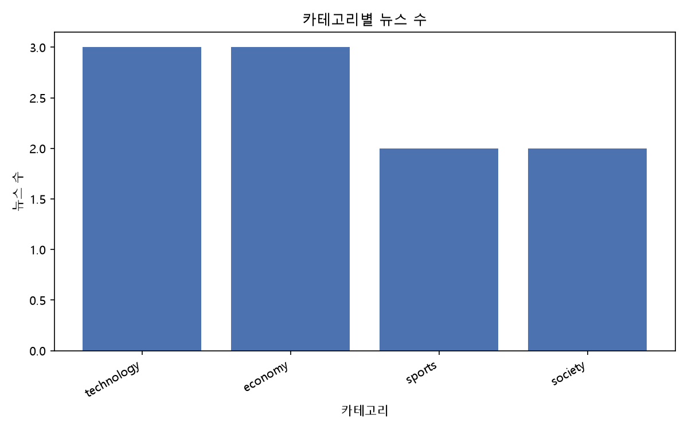
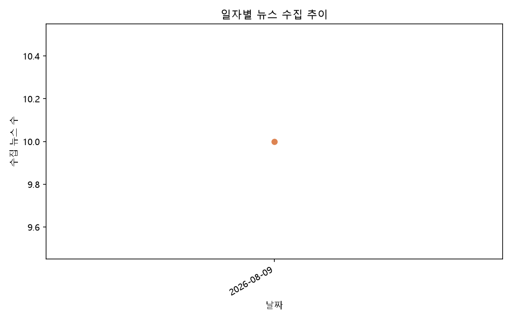
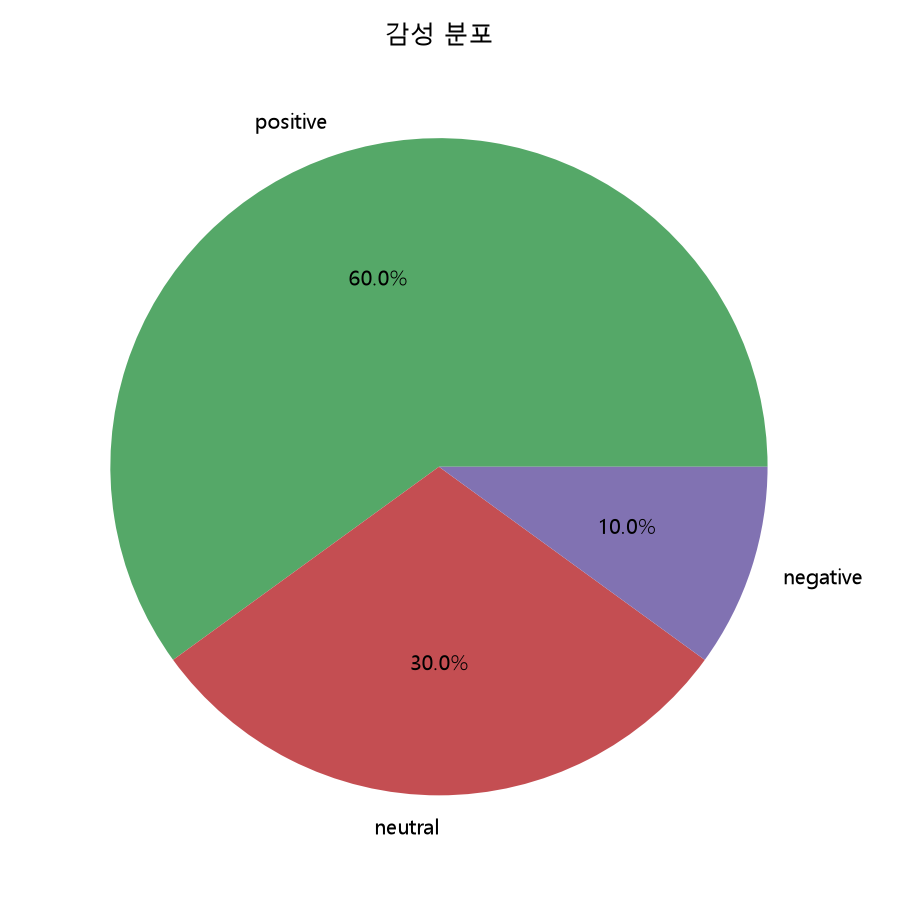

# news-data-pipeline

뉴스를 수집하고, 정제하고, AI로 요약·분석한 뒤, 차트와 리포트를 생성하고, 데이터를 내보내는
**CLI 기반** Python 데이터 파이프라인입니다. 웹 UI는 없습니다.

Docker, FastAPI, Celery, LangChain 같은 무거운 기술 없이
기본 Python 모듈(argparse, sqlite3, requests 등)만으로 구현했습니다.

## 1. 프로젝트 소개

이 프로젝트는 다음 흐름을 하나의 CLI로 연결합니다.

```
뉴스 수집 → Raw 저장 → 데이터 정제 → Clean 저장 → AI 요약 → AI 인사이트 분석 → 시각화 → 리포트 → CSV/JSONL/Excel 내보내기
```

OpenAI API 키가 없어도 수집(RSS)·정제·리포트·내보내기까지는 그대로 동작합니다.
AI 요약/분석/감성분석 기능만 `OPENAI_API_KEY`가 필요합니다.

## 2. 아키텍처

```
News Source (RSS / API / 웹 크롤링)
     ↓
Collector (collector.py)
     ↓
Raw Data (SQLite news 테이블, status='raw')
     ↓
Cleaner (cleaner.py)
     ↓
Clean Data (status='clean')
     ↓
SQLite (database.py, data/database/news.db)
     ↓
AI Summarizer (summarizer.py) → status='summarized'
     ↓
AI Analyzer (analyzer.py) → analysis_results 테이블
     ↓
Visualizer (visualizer.py) → charts/*.png
     ↓
Reporter (reporter.py) → reports/*.md, *.txt
     ↓
Exporter (exporter.py) → reports/*.csv, *.jsonl, *.xlsx
```

## 3. 프로젝트 구조

```
news-data-pipeline/
├── main.py          CLI 진입점 (argparse 서브커맨드)
├── config.py         config.json / .env 로딩, 로깅 설정, 경로 관리
├── database.py        SQLite 스키마 및 CRUD
├── collector.py        RSS/API 수집, BeautifulSoup 크롤링
├── cleaner.py         텍스트/날짜 정규화, 필수 필드 검증
├── summarizer.py       OpenAI 기반 뉴스 요약, 감성 분석
├── analyzer.py         OpenAI 기반 인사이트 분석
├── visualizer.py        matplotlib 차트 생성 (한글 폰트 처리 포함)
├── reporter.py         리포트(TXT/MD) 생성
├── exporter.py         CSV/JSONL/Excel 내보내기
├── config.json         뉴스 소스, 중복 정책 등 설정
├── requirements.txt
├── .env
├── data/
│   ├── raw/           (필요 시 원본 백업용)
│   ├── clean/          (필요 시 정제본 백업용)
│   ├── sample/          sample_news.json (API 키 없이 테스트용)
│   └── database/         news.db (SQLite, 영구 저장)
├── reports/            생성된 리포트 및 export 파일
├── charts/             생성된 PNG 차트
├── logs/               app.log
└── tests/              단위 테스트
```

## 4. 설치 방법

```bash
python -m venv .venv
```

Windows:
```bash
.venv\Scripts\activate
```

macOS/Linux:
```bash
source .venv/bin/activate
```

의존성 설치:
```bash
pip install -r requirements.txt
```

## 5. 환경변수 설정

`.env`에 OpenAI API 키를 입력하세요.

```bash
cp .env.example .env
```

```
OPENAI_API_KEY=your_api_key_here
```

API 키가 없어도 `fetch`, `clean`, `report`, `export`, `list`, `show`, `load-sample`은 정상 동작합니다.
`summarize`, `analyze`(및 보너스 감성분석)만 API 키가 필요합니다.

## 6. 실행 방법

### API 키 없이 전체 파이프라인 체험 (샘플 데이터)

```bash
python main.py load-sample
python main.py clean --all
python main.py report --format md
python main.py export --format csv
```

### 실제 파이프라인

```bash
# 1. 뉴스 수집 (RSS 기본)
python main.py fetch --limit 20
python main.py fetch --limit 5 --dry-run     # DB에 저장하지 않고 미리보기

# 2. 데이터 정제
python main.py clean --all

# 3. AI 요약 (OPENAI_API_KEY 필요)
python main.py summarize --unsummarized

# 4. AI 인사이트 분석 (OPENAI_API_KEY 필요)
python main.py analyze --start-date 2026-08-01 --end-date 2026-08-09

# 5. 리포트 생성 (차트 포함)
python main.py report --format md

# 6. 데이터 내보내기
python main.py export --format csv
python main.py export --format jsonl
python main.py export --format xlsx --status summarized

# 보너스: 조회
python main.py list --category technology
python main.py show --id 1
```

## 7. 뉴스 수집 방법

`collector.py`는 두 가지 수집 방식을 함수 단위로 분리해 제공합니다.

- `fetch_from_rss()` — RSS 피드 수집 (기본, `config.json`의 `rss_sources`에서 설정)
- `fetch_from_api()` — 공개 뉴스 API(JSON) 수집
- `crawl_news_page()` — BeautifulSoup 기반 웹 크롤링

**크롤링 윤리**: 실제 서비스에서는 RSS/API 수집을 우선 사용하세요. 크롤링을 사용할 경우
`crawl_news_page()`는 자동으로 robots.txt를 확인하고, User-Agent를 명시하며, 요청 사이
delay(`config.json`의 `crawl_delay_seconds`)를 둡니다. 짧은 시간에 대량 요청을 보내지 마세요.

## 8. 중복 뉴스 처리

`config.json`의 `duplicate_policy`로 제어합니다.

```json
{ "duplicate_policy": "skip" }
```

- `skip`: URL이 이미 존재하면 저장하지 않음
- `upsert`: URL이 이미 존재하면 기존 행을 업데이트

## 9. 데이터베이스

SQLite를 사용하며 프로그램을 재실행해도 데이터가 유지됩니다.

- 위치: `data/database/news.db`
- `news` 테이블: 뉴스 원문/정제본/요약/감성/상태 저장
- `analysis_results` 테이블: AI 인사이트 분석 결과 저장

## 10. 로깅

모든 실행 로그는 `logs/app.log`와 콘솔에 동시에 기록됩니다 (INFO/WARNING/ERROR).

## 11. 테스트

```bash
python -m unittest discover -s tests -v
```

외부 API를 호출하지 않는 순수 로직(DB, 정제, export, CLI 파싱)을 검증합니다.
OpenAI API를 직접 호출하는 테스트는 포함하지 않습니다 (비용 방지).

## 12. 정기 실행 (보너스)

**Windows (Task Scheduler)**: 작업 스케줄러에서 새 작업을 만들고,
프로그램/스크립트에 `.venv\Scripts\python.exe`, 인수에 `main.py fetch --limit 20`,
시작 위치에 프로젝트 경로를 지정하세요.

**Linux/macOS (cron)**:
```bash
0 9 * * * cd /path/to/news-data-pipeline && .venv/bin/python main.py fetch --limit 20
```

## 13. 알려진 제약

- 기본 제공 RSS 소스는 예시이며, `config.json`의 `rss_sources`에서 자유롭게 교체할 수 있습니다.
- 한글 폰트가 없는 환경(Docker 등)에서는 차트의 한글이 깨질 수 있으나, 프로그램은 계속 실행됩니다
  (`visualizer.setup_korean_font()`가 실패 시 기본 폰트로 폴백).
- 감성 분석(`sentiment`)은 `summarize` 실행 후 별도 로직을 통해 채워지며, OpenAI API 키가 필요합니다.

## 14. 리포트 결과 예시

# 뉴스 데이터 파이프라인 리포트
생성 시각: 2026-08-09 17:10:29

## 데이터 개요
- 분석 기간: 전체 ~ 전체
- 수집 뉴스 수: 10건
- 분석 카테고리: 전체

## 품질 지표
- 데이터 완전성: 100.0%
- 중복률: 0.0%
- 요약 성공률: 100.0%
- 필수 필드 충족률: 100.0%

## TOP 키워드
- 국내: 2회
- 확대: 2회
- AI: 1회
- 반도체: 1회
- 수요: 1회
- 급증: 1회
- 기업: 1회
- 수혜: 1회
- 전망: 1회
- 정부: 1회

## 카테고리별 뉴스 수
- technology: 3건
- economy: 3건
- sports: 2건
- society: 2건

## 최신 뉴스 TOP 10
- [2026-08-09 14:10:00] 지역 축제 개최, 관광객 몰려 (https://example.com/news/local-festival)
- [2026-08-09 09:45:00] 중앙은행, 기준금리 동결 결정 (https://example.com/news/interest-rate-freeze)
- [2026-08-08 20:00:00] 축구 국가대표팀, 평가전서 완승 (https://example.com/news/national-team-win)
- [2026-08-07 11:20:00] 전기차 배터리 기술 혁신, 주행거리 대폭 향상 (https://example.com/news/ev-battery-innovation)
- [2026-08-06 12:00:00] 여름철 폭염 지속, 온열질환 주의보 발령 (https://example.com/news/heatwave-warning)
- [2026-08-05 15:30:00] 국내 증시, 외국인 매수세에 상승 마감 (https://example.com/news/stock-market-rally)
- [2026-08-04 08:15:00] 스마트폰 신제품 출시, 폴더블 시장 확대 (https://example.com/news/foldable-phone-launch)
- [2026-08-03 18:00:00] 프로야구 정규시즌 순위 경쟁 치열 (https://example.com/news/baseball-standings)
- [2026-08-02 10:30:00] 정부, 신재생에너지 투자 확대 발표 (https://example.com/news/renewable-energy-investment)
- [2026-08-01 09:00:00] AI 반도체 수요 급증, 국내 기업 수혜 전망 (https://example.com/news/ai-semiconductor-demand)

## AI 인사이트 분석
**1. 주요 트렌드**

- **기술 및 산업 혁신 가속화**: AI 반도체, 2차전지, 전기차 배터리 등 첨단 산업에서의 기술 발전과 신제품 출시가 활발하다. 데이터센터, 신재생에너지 등 미래 산업에 대한 투자와 성장이 두드러진다.
- **경제 및 금융시장 안정**: 외국인 투자자 유입과 코스피 상승, 기준금리 동결 등 금융시장이 비교적 안정적인 흐름을 보이고 있다.
- **환경 및 에너지 전환**: 정부의 신재생에너지 투자 확대, 전기차 배터리 기술 혁신 등 친환경 에너지와 관련 산업의 성장세가 뚜렷하다.
- **사회·생활 이슈 부각**: 폭염 등 기상 이슈와 이에 따른 보건당국의 대응, 지역 축제를 통한 경제 활성화 등 생활 밀착형 이슈도 주목받고 있다.
- **스포츠 경쟁 심화**: 프로야구, 축구 등 주요 스포츠 리그에서 치열한 경쟁이 이어지며 국민적 관심을 끌고 있다.

---

**2. 핵심 키워드 (5~10개)**

- AI 반도체
- 신재생에너지
- 2차전지/배터리
- 데이터센터 투자
- 외국인 투자
- 코스피 상승
- 폭염/온열질환
- 지역경제 활성화
- 스포츠 경쟁
- 공급망 불안정

---

**3. 공통점 / 차이점**

- **공통점**
  - 첨단 기술과 산업 발전(반도체, 배터리, 신형 스마트폰 등)이 경제 성장과 직결되고 있음.
  - 정부 정책 및 투자(신재생에너지, 금리 동결 등)가 시장과 산업에 큰 영향을 미침.
  - 사회 전반에 걸쳐 경쟁(스포츠, 산업, 시장)이 심화되고 있음.
  - 환경 및 생활 이슈(폭염, 지역 축제 등)가 국민 생활과 경제에 영향을 주고 있음.

- **차이점**
  - 일부 이슈(폭염, 온열질환)는 단기적·계절적 현상인 반면, 산업·기술 트렌드는 중장기적 변화에 해당.
  - 경제·산업 뉴스는 주로 성장과 혁신, 투자에 초점을 두는 반면, 스포츠 및 지역 뉴스는 경쟁, 성과, 지역 활성화에 초점을 둠.
  - 공급망 불안정, 금리 동결 등은 리스크 관리와 안정성에 방점이 찍혀 있음.

---

**4. 시사점**

- **미래 성장동력 확보 필요성**: AI, 배터리, 신재생에너지 등 첨단 산업이 국가 경제의 핵심 성장동력으로 부상하고 있으며, 지속적인 기술 혁신과 투자 확대가 필수적임을 시사한다.
- **정책과 시장의 상호작용 강화**: 정부의 정책 결정(투자, 금리 등)이 산업 및 금융시장에 직접적 영향을 미치고 있어, 정책 신뢰성과 예측가능성이 중요해지고 있다.
- **리스크 관리의 중요성**: 공급망 불안정, 기후 이변 등 예측 불가능한 리스크에 대한 선제적 대응과 관리가 필요하다.
- **생활 밀착형 이슈 대응 강화**: 폭염, 지역경제 활성화 등 국민 생활과 직결된 이슈에 대한 신속하고 효과적인 대응이 사회적 신뢰를 높이는 데 중요하다.
- **경쟁력 확보와

## 생성된 차트
- charts/category_distribution.png


- charts/daily_collection_trend.png


- charts/sentiment_distribution.png

